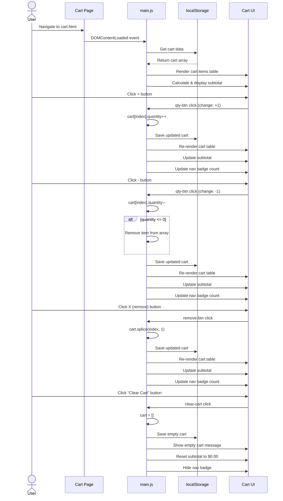
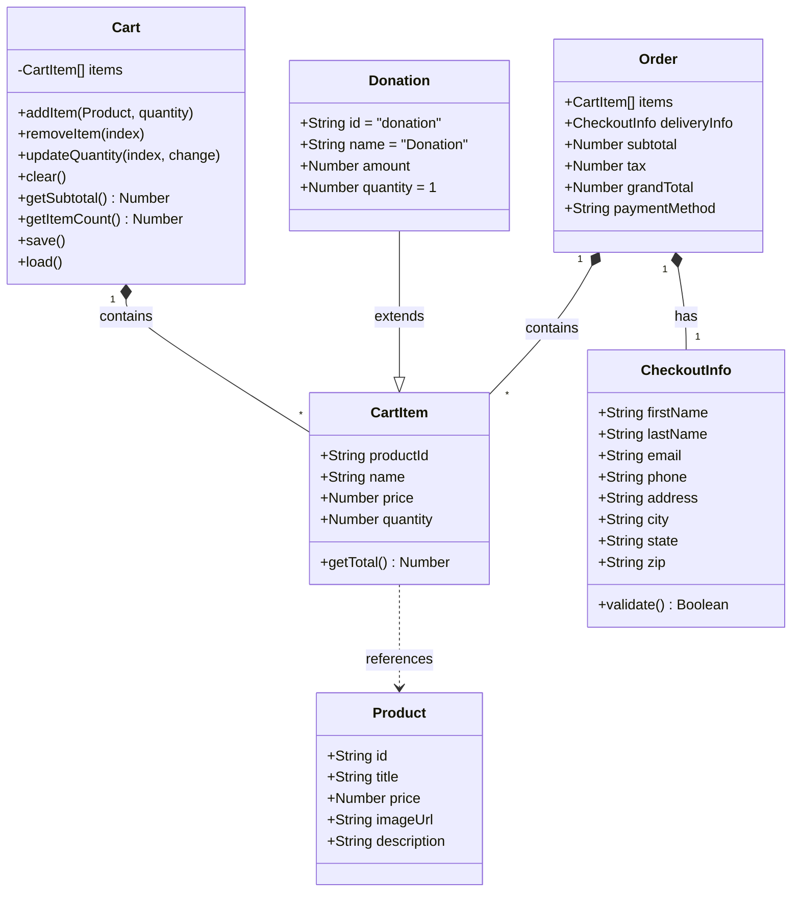
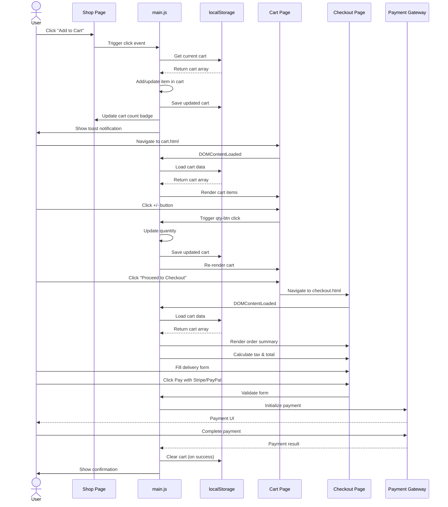

# UML Diagrams - Zonta Club Website

## 1. Cart Management Sequence Diagram

Shows the flow of managing items in the shopping cart.

---

## 2. Class Diagram

Shows the data structures used in the application.

---

## 3. Sequence Diagram

Shows the flow of adding an item to cart and completing checkout.

---

## 4. Activity Diagram

Shows the complete shopping workflow from browsing to purchase.

---

## Diagram Descriptions

### 1. Cart Management Sequence Diagram
Details all cart interactions: loading cart data, increasing/decreasing quantities (with auto-removal when quantity hits zero), removing items via the X button, and clearing the entire cart. Shows how each action updates localStorage and refreshes the UI.

### 2. Class Diagram
Shows the data structures used throughout the application:
- **Product**: Represents items in the shop
- **CartItem**: Items stored in the shopping cart
- **Cart**: Manages the collection of cart items with localStorage persistence
- **Donation**: Special cart item type for donations
- **CheckoutInfo**: Delivery/billing information
- **Order**: Complete order with items, delivery info, and totals

### 3. Sequence Diagram
Details the interaction flow between the user, UI components, JavaScript logic, and localStorage during the add-to-cart and checkout processes.

### 4. Activity Diagram
Shows the complete user journey from browsing products through to completing a purchase, including all decision points and alternative paths (donations, cart management, payment processing).

---
