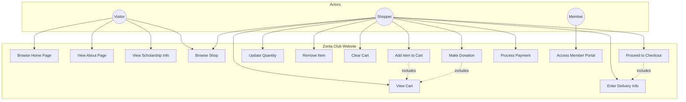
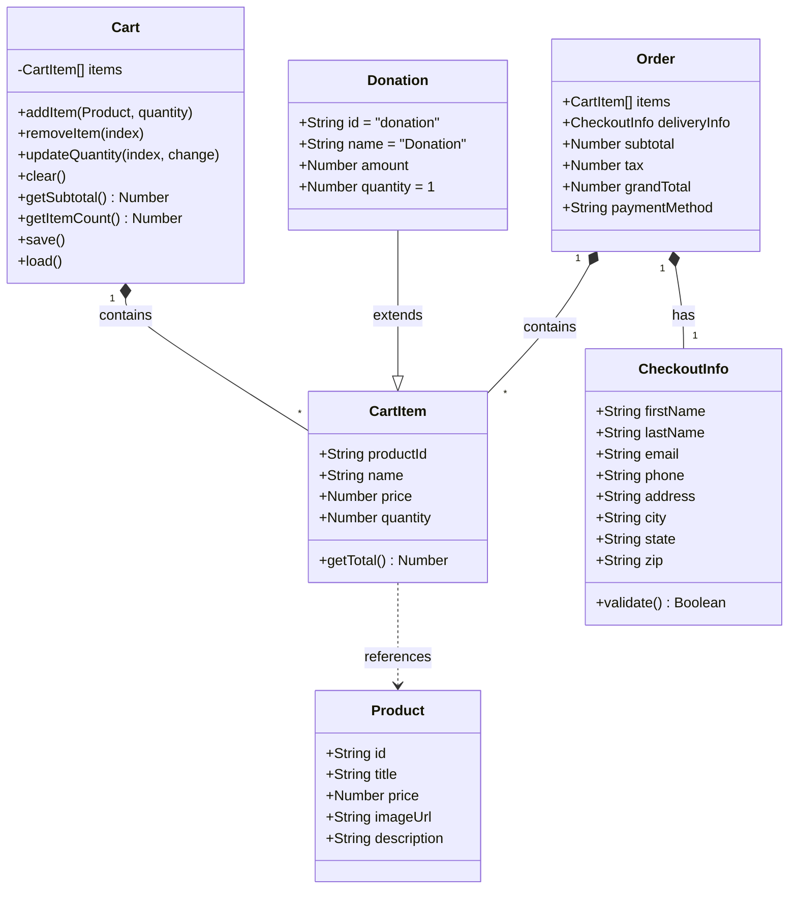
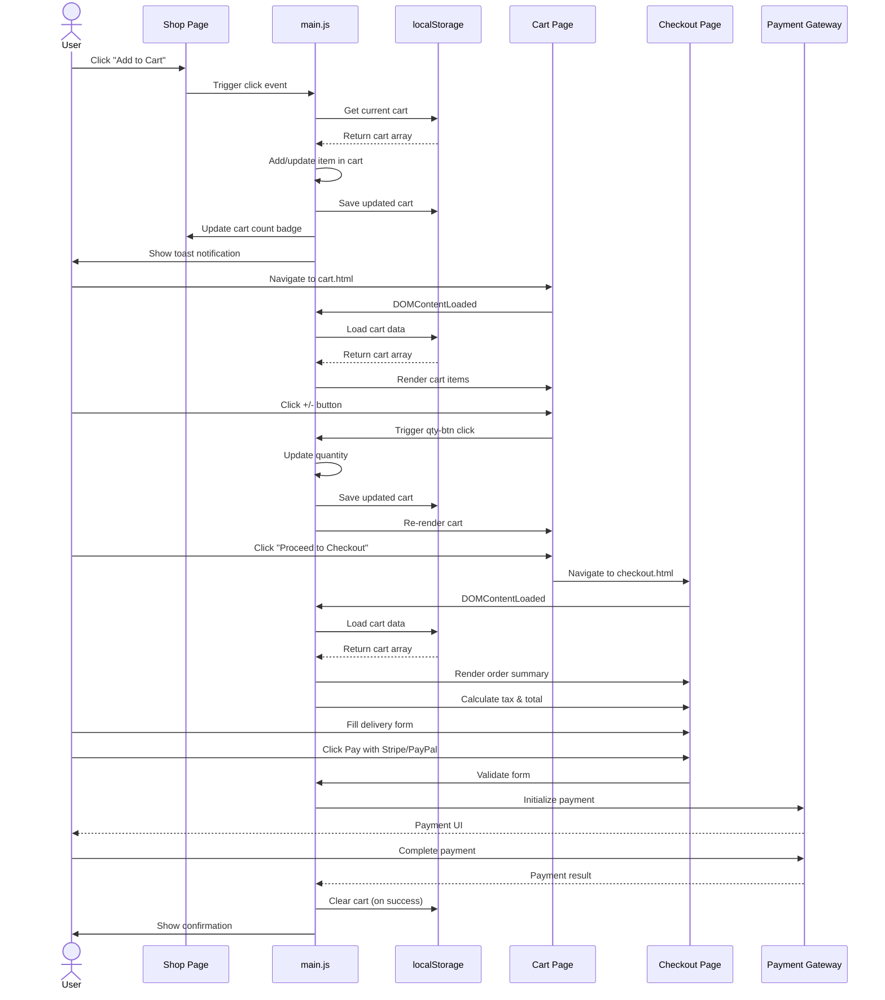
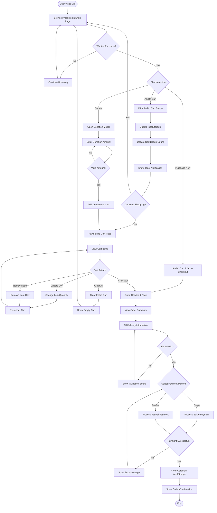

# UML Diagrams - Zonta Club Website

## 1. Use Case Diagram

Shows the interactions between users and the system.

---

## 2. Class Diagram

Shows the data structures used in the application.

---

## 3. Sequence Diagram

Shows the flow of adding an item to cart and completing checkout.

---

## 4. Activity Diagram

Shows the complete shopping workflow from browsing to purchase.

---

## Diagram Descriptions

### 1. Use Case Diagram
Illustrates the three types of users (Visitor, Shopper, Member) and the actions they can perform on the website. Visitors can browse content, Shoppers can use the full e-commerce functionality, and Members can access the external member portal.

### 2. Class Diagram
Shows the data structures used throughout the application:
- **Product**: Represents items in the shop
- **CartItem**: Items stored in the shopping cart
- **Cart**: Manages the collection of cart items with localStorage persistence
- **Donation**: Special cart item type for donations
- **CheckoutInfo**: Delivery/billing information
- **Order**: Complete order with items, delivery info, and totals

### 3. Sequence Diagram
Details the interaction flow between the user, UI components, JavaScript logic, and localStorage during the add-to-cart and checkout processes.

### 4. Activity Diagram
Shows the complete user journey from browsing products through to completing a purchase, including all decision points and alternative paths (donations, cart management, payment processing).

---

## How to View These Diagrams

These diagrams are written in **Mermaid** syntax and can be viewed:

1. **GitHub**: Renders automatically in README/markdown files
2. **VS Code**: Install "Markdown Preview Mermaid Support" extension
3. **Online**: Paste into [Mermaid Live Editor](https://mermaid.live)
4. **Export**: Use Mermaid CLI to export as PNG/SVG
